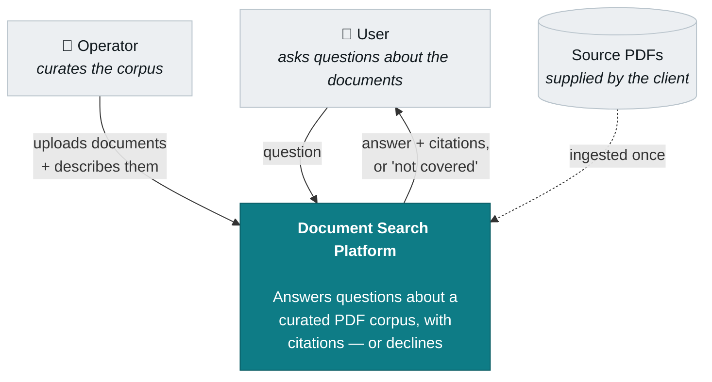
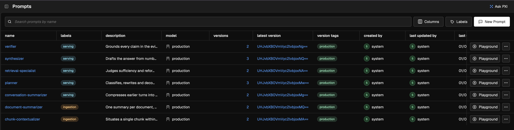
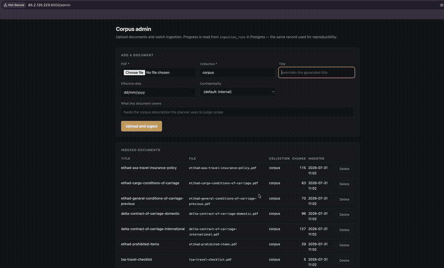
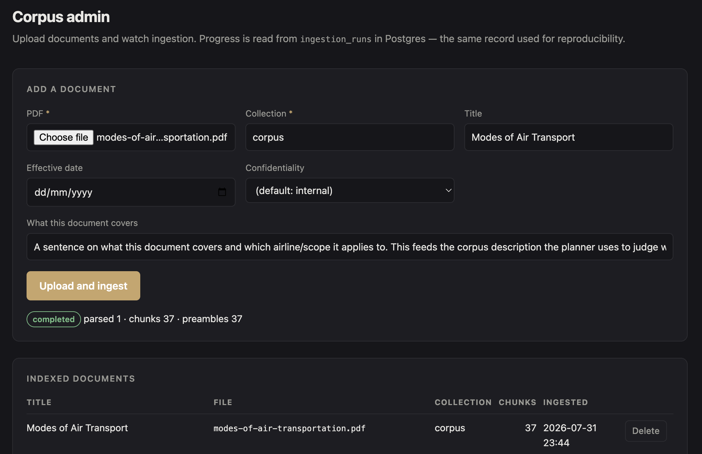

# Document Search Platform

Agentic RAG over a curated PDF corpus. An operator uploads documents through an
admin page; a user asks questions through a chat interface. Every answer is
grounded in the corpus, cites the passages it came from, and declines outright
when the corpus does not cover the question — rather than answering from the
model's own knowledge.

Retrieval runs through a planner → retrieval → synthesizer → verifier pipeline,
not a single prompt: the planner decides whether a question is even answerable
from this corpus before any search happens, the retrieval step retries against a
shared budget, the synthesizer writes only from the passages it was given, and a
separate verifier — with no visibility into how the draft was reasoned — checks
every claim against the evidence before anything reaches the user.

## Architecture



Two actors, no external services at runtime — every model runs locally. The
full container, component, ingestion-flow and query-flow diagrams live in
[doc/02-architecture.md](doc/02-architecture.md), which is the canonical
description of the system; this README stays high-level and links into it and
the rest of [`doc/`](doc/) rather than restating the design.

## Demo

### 1 · Prompt registration through Arize Phoenix

All seven prompts versioned in the registry — resolved by tag at runtime,
degrading to the bundled files on disk if Phoenix is unreachable. Labels split
the read-path prompts (`serving`) from the two that only run during ingestion.
Full input/output for each: [components/08-arize-phoenix.md
§3](doc/components/08-arize-phoenix.md#3-the-prompt-inventory).

Registration happens automatically at backend startup, before any document can
be ingested or any question answered — not a manual step, so ingestion below is
always working with a versioned prompt, never a hardcoded string.



### 2 · Ingestion

Uploading a new PDF through the admin page — duplicate detection, progress
polled from `ingestion_runs`, and the resulting chunk count.



Same run, at rest — a new PDF hashed, parsed, chunked and indexed:



### 3 · Chat and retrieval

Asking the agentic-rag model questions grounded in the ingested corpus — a
direct answer with citations, an honest decline on a question the document
never actually defines, and a follow-up that stays in the same conversation.

<video src="https://raw.githubusercontent.com/chirag-sanghvi-93/document_search_platform/master/doc/media/demo-03-chat.mp4" controls width="900">
  Your browser cannot render this video inline — download it directly:
  <a href="doc/media/demo-03-chat.mp4">doc/media/demo-03-chat.mp4</a>.
</video>

## Quick start

### Prerequisites

- Docker, with Compose
- [Ollama](https://ollama.com), installed and running **natively on the host** —
  not in a container. On macOS, containers cannot reach the Metal GPU; a
  containerised model host would run CPU-only, which is unusably slow for
  per-chunk ingestion work. (On Linux with an NVIDIA GPU, a Compose overlay
  brings Ollama into the stack instead — see `docker-compose.linux.yml`.)
- ~11 GB free for models, ~4 GB for the Docker images

### 1 · Pull the models

```bash
ollama serve                             # in a separate terminal
make models
```

Pulls the four models the system actually runs, in order of size:

| Model | Size | Used for |
|---|---|---|
| `bge-m3` | 1.2 GB | Embeddings — chunks and queries |
| `qwen2.5:3b` | 1.9 GB | Chunk contextualisation during ingestion (non-reasoning, by design — see `app/shared/config.py`) |
| `qwen3:4b` | 2.5 GB | Per-document summarisation during ingestion |
| `qwen2.5:7b` | 4.7 GB | Planning, retrieval judgement, synthesis and verification on the read path |

### 2 · Install and start the stack

```bash
make install                             # host-side deps — needed for the CLI commands below
make up                                  # builds and starts everything else in Docker
make migrate                             # applies the schema — not automatic on container start
```

`make up` waits for `/health/ready` before returning, then prints the three URLs below.

| Surface | URL |
|---|---|
| Chat interface | http://localhost:3000 |
| Backend API | http://localhost:8000/docs |
| Admin page — upload & manage documents | http://localhost:8000/admin |
| Traces & prompts (Arize Phoenix) | http://localhost:6006 |

### 3 · Ingest a document and ask a question

```bash
cp your-file.pdf data/raw/
make ingest COLLECTION=corpus            # defaults to COLLECTION=default if omitted
```

Progress is visible on the admin page above, or by polling
`GET /ingestion-runs/{id}`. Once it completes, ask a question either through
the chat interface at `:3000`, or directly against the OpenAI-compatible API:

```bash
curl http://localhost:8000/v1/chat/completions \
  -H "Content-Type: application/json" \
  -d '{"model":"agentic-rag","messages":[{"role":"user","content":"your question"}]}'
```

## Running the evaluation

```bash
ollama pull gemma3:12b                   # the judge model — deliberately a different
                                          # family from the answering model, so it is
                                          # not grading its own output
uv run python -m eval.cli --collection corpus
```

Scores declining behaviour (answerable / out-of-scope / near-miss, never
averaged together), citation validity, and RAGAs metrics on the answerable
slice — then fits `keep_floor` on a held-out calibration split and reports
accuracy on a separate evaluation split. Exits non-zero on a correctness
failure (an inert agent, a leaked fabrication, a citation pointing at nothing),
not merely a low score. See [components/09-ragas.md](doc/components/09-ragas.md).

## Commands

```bash
make test-unit    # fast — no services required
make test         # everything, including Postgres and Ollama
make lint
make typecheck
make down
```

## Documentation

| | |
|---|---|
| [Problem statement](doc/01-problem-statement.md) | The requirements in plain language |
| [Architecture](doc/02-architecture.md) | **Canonical** — containers, components, both pipelines |
| [Components](doc/components/) | One document per baseline item |
| [Architecture decisions](doc/adr/) | Context, alternatives considered, and consequences for each open design choice |

[`requirements/`](requirements/) holds the brief exactly as received and is never
edited. Everything in `doc/` is authored by us and traces back to it.
