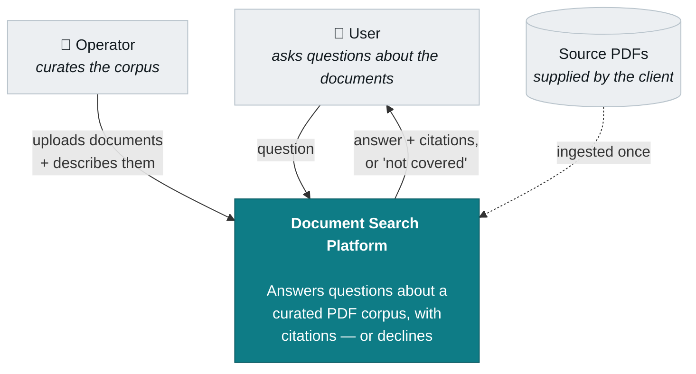
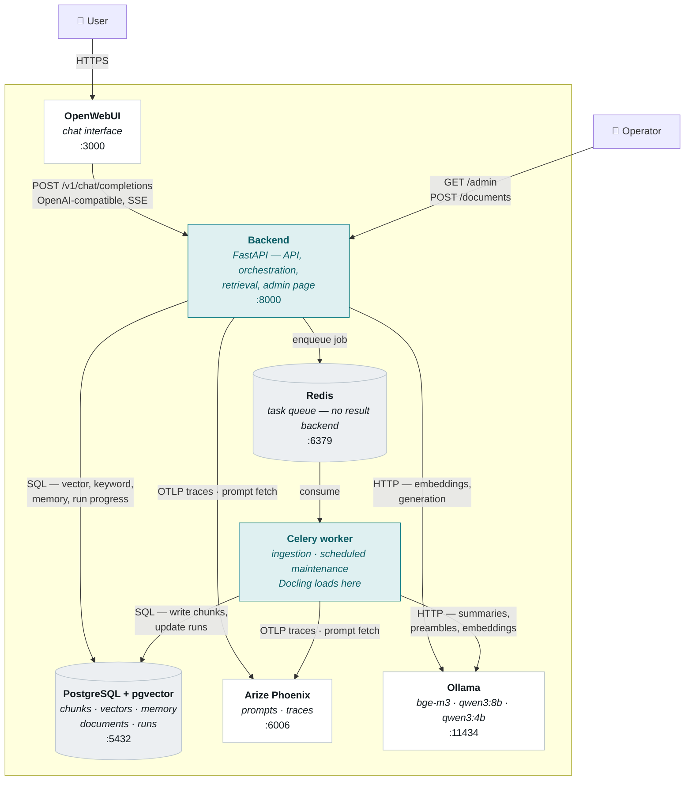
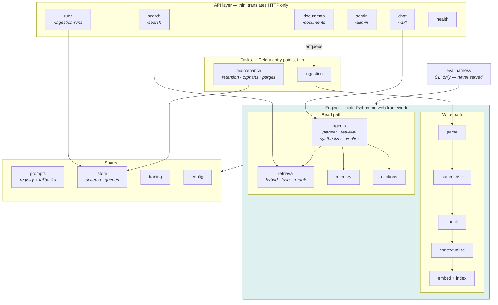
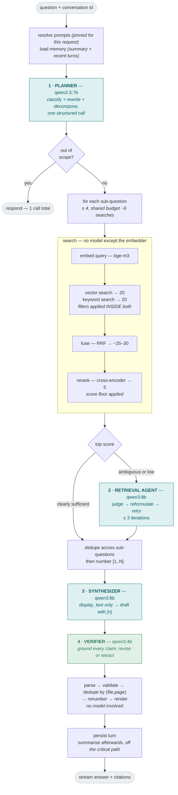
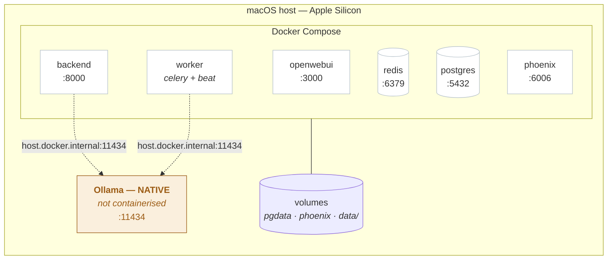

# 02 · Architecture

> **This document is the canonical description of the system's structure and flow.** Where a
> component document and this one disagree about *ordering* or *what talks to what*, this one is
> correct — the component documents describe their own scope and cannot see the whole.
>
> Diagram levels follow the [C4 model](https://c4model.com): context, containers, components, plus
> dynamic and deployment views. Level 4 (code) is deliberately omitted — it earns its place only when
> generated from source.
>
> Diagrams are Mermaid, rendered inline by GitHub. The source *is* the design; there is no exported
> image to drift out of date.

---

## 1. Context

What the system is, who uses it, and what sits outside the boundary.

**What to notice**

**Two distinct actors.** The operator administers the corpus; the user queries it. End users cannot
add documents — that is a scope decision, not an omission. A document *search* platform curates
centrally; a personal document assistant would be a different product with different access-control
questions.

**No external services.** Nothing crosses the boundary at runtime. Every model runs locally, which is
what constraint 3.1 requires. The only inbound flow is documents, and that happens once.

---

## 2. Containers

The deployable pieces and how they communicate.

**What to notice**

**The backend and the worker are the only components that talk to anything else.** Nothing else is
permitted to — in particular, the chat interface must never reach the model host directly, or it would
bypass retrieval entirely and answer from the model's own knowledge. That is enforced by
configuration, not by convention.

**Two processes, one codebase.** The worker runs the same engine package as the backend; only the
entry point differs. It exists because ingestion takes minutes to hours and cannot run on a request
thread, not because it does something the backend could not.

**Redis carries jobs and nothing else.** There is no result backend — `task_ignore_result=True`.
Progress is read from `ingestion_runs` in Postgres, the record that already exists for
reproducibility, so there is never a second and competing account of what a job is doing.

⚠️ **The worker must mount `data/` at the same path as the backend.** The API writes the uploaded
file; the worker reads it. When the two disagree about that path, the symptom is a `FileNotFoundError`
in Docling on a file the API demonstrably just wrote.

**The re-ranker is not a container.** It is a cross-encoder running in-process inside the backend, not
served by the model host. Different serving pattern, and it is why "all models are in Ollama" is not
quite true.

**Phoenix carries traffic in both directions.** Traces flow out; prompts flow in. If it is unreachable
the system serves bundled prompts and keeps answering — an observability outage must not become an
availability outage.

---

## 3. Components

Inside the backend. This is also the map to code modules — design choice 5.2.

**What to notice**

**The engine never imports the web framework.** Ingestion runs as a Celery task and as a CLI;
evaluation runs only as a CLI. If engine code depended on request context, neither would work. The API
layer translates HTTP into calls on ordinary functions and back — nothing below it knows it is being
served.

**`tasks/` is a caller, not a layer.** Celery tasks are thin wrappers over engine pipelines, exactly
as API routes are. The same work is reachable three ways — endpoint, task, CLI — precisely because
none of the three owns it.

**`documents` does not call the write path directly.** It writes the file, records the run, and
enqueues. The only synchronous work on that request is the content hash, which is what decides whether
there is any work at all.

**Evaluation is outside the served application.** It drives the engine directly. Runtime operations
get endpoints; development operations get CLIs.

**The write path and read path share almost nothing** — different models, different stages, different
failure modes. They meet only at `store`.

---

## 4. Ingestion flow

Runs in the Celery worker, off the request thread. Every stage is bounded and resumable.

```mermaid
flowchart TB
    start(["POST /documents &nbsp;·or·&nbsp; CLI over data/raw/<br/>PDF + collection + optional metadata"]) --> hash["<b>1</b> hash file contents<br/><i>SHA-256 — synchronous, before enqueue</i>"]

    hash --> indexed{"already indexed<br/>at this hash?"}
    indexed -->|yes| skip(["skip"])

    indexed -->|no| parsecache{"parse cached?"}
    parsecache -->|yes| loadparse["load from<br/><i>data/processed/</i>"]
    parsecache -->|no| parse["<b>2</b> parse — Docling<br/><i>layout · tables · headings · title</i>"]
    parse --> writeparse["write parse cache"]

    loadparse --> summarise
    writeparse --> summarise

    summarise["<b>3</b> summarise — <i>per DOCUMENT</i><br/>qwen3:4b — <i>skipped if a description<br/>was supplied at upload</i>"]
    summarise --> chunk["<b>4</b> chunk — HybridChunker<br/><i>display_text + heading path</i>"]

    chunk --> ctxcache{"preamble<br/>cached?"}
    ctxcache -->|yes| loadctx["load from<br/><i>data/preambles/</i>"]
    ctxcache -->|no| contextualise["<b>5</b> contextualise — <i>per CHUNK</i><br/>qwen3:4b"]
    contextualise --> writectx["write preamble cache"]

    loadctx --> assemble
    writectx --> assemble

    assemble["<b>6</b> assemble embedding_text<br/><i>heading path + preamble + display_text</i>"]
    assemble --> nodes["<b>7</b> build nodes"]
    nodes --> embed["<b>8</b> embed — bge-m3<br/><i>vector(1024)</i>"]
    embed --> write["<b>9</b> delete document row + insert<br/><i>ONE transaction, cascade removes old chunks</i>"]
    write --> done(["indexed"])

    classDef model fill:#DFF0F1,stroke:#0E7C86,color:#0A5C64
    classDef cache fill:#FAEFDD,stroke:#9C5C15,color:#9C5C15
    classDef term fill:#ECEFF2,stroke:#B9C4CC
    class summarise,contextualise,embed model
    class loadparse,writeparse,loadctx,writectx cache
    class start,skip,done term
```

**What to notice**

**Hashing happens before the job is queued.** It is the one piece of ingestion cheap enough to run on
the request thread, and it is what decides whether there is any ingestion to do — an unchanged file
returns `duplicate` at the door rather than occupying the queue to discover the same thing.

**Summarisation precedes contextualisation, and must.** Each document's summary is an *input* to
every one of that document's chunk-level calls. Reversing them leaves the contextualiser with only a
heading path, which is what the "context from structure, not proximity" design exists to avoid.

**A supplied description replaces the generated summary entirely**, and step 3 is skipped. Operator
metadata is authoritative; generation is the fallback. This is the same relationship prompts have with
their bundled defaults.

**Two caches, keyed differently on purpose.** The parse cache keys on file hash *and Docling version*.
The preamble cache keys on **chunk text**, prompt version and model — deliberately not on position,
so that retuning chunk size does not discard the corpus's preambles. That is the difference between a
chunking experiment costing minutes and costing hours.

**Stages are batched by model, never interleaved per chunk.** All summaries, then all preambles, then
all embeddings. Interleaving would swap models thousands of times — silently turning a twenty-minute
run into a fourteen-hour one, with correct output throughout.

**Step 9 is one transaction.** Between the delete and the insert the document has no chunks at all;
if that gap is not atomic, a crash leaves the document invisible to search with nothing reporting it.

---

## 5. Query flow

Runs per question. Four model calls for a simple lookup — and **one** for a
question that needs no retrieval at all.

> ⚠️ **Two short-circuits sit in front of this flow**, both owned by the
> application rather than by any agent, and both added after measurement:
>
> | Intent | Cost | Why it exists |
> |---|---|---|
> | `out_of_scope` | 1 call, 0 searches | The corpus plainly does not cover it. Designed in from the start |
> | `capability` | 1 call, 0 searches | *"What can I ask you?"* is a question about the **system**, not the documents. Without this branch it was planned as an ordinary lookup, searched a corpus of baggage rules, and refused **after five minutes** with irrelevant near misses. The corpus description is already loaded to judge scope, so answering from it costs nothing more |

**What to notice**

**The out-of-scope branch short-circuits before any retrieval** — one call instead of four, on
questions that were never answerable.

**The fast path skips the retrieval agent** when the first search returns clearly sufficient evidence.
The score is a calibrated signal, not a guess, and the agent still fires whenever the system is
genuinely uncertain. It is configurable, so the ablation study measures whether it costs anything.

**Verification precedes citation assembly.** The verifier rewrites the text carrying the markers, so
parsing them first would produce a map against a draft that no longer exists — and a retracted claim
takes its marker with it, leaving a hole in the numbering.

**Two deduplications, different keys, different times.** Across sub-questions by *chunk*, before
drafting, so the model never sees a duplicate. Then by *(file, page)*, after verification, so the
reader is not shown one source twice as though it were two.

**Everything after verification is bookkeeping.** No model is involved, so nothing there can be wrong
in an interesting way.

---

## 6. Deployment

What runs where, and why one thing is deliberately outside the container stack.

> **The topology below is host-agnostic and has been run on two.** The rule that
> shapes it — *Ollama runs natively, everything else in Compose* — holds in both
> places for different reasons:
>
> | | macOS (Apple Silicon) | AWS `g4dn.xlarge` (Tesla T4) |
> |---|---|---|
> | Why Ollama is outside Compose | Containers cannot reach the Metal GPU | Keeps one topology; avoids the NVIDIA container toolchain |
> | `host.docker.internal` | Provided natively; adding `host-gateway` **breaks** it | Does not exist; `host-gateway` is **required** |
> | Overlay | base compose file | `docker-compose.linux.yml` |
>
> ⚠️ Two defects only surfaced when the container was finally asked to do real
> work, because on macOS every heavy task was run on the host with `uv run`:
> `alembic.ini` was never copied into the image (migrations present, nothing
> telling Alembic where they are), and `python-slim` carries no graphics
> libraries, so Docling died on `import cv2`. **The container had never parsed a
> PDF or run a migration.** Both are fixed in the Dockerfile.

**Six containers, one image built twice.** `backend` and `worker` are the same image with different
commands — `uvicorn` against `app.main` for one, `celery worker --beat` for the other. Two processes
with one dependency set and one build.

**Why Ollama is not a container**

Containers on macOS cannot reach the Metal GPU. A containerised model host would run CPU-only —
unusably slow for the per-chunk work in ingestion, and unacceptable for generation. It runs natively
and is reached at `host.docker.internal:11434`.

A Compose profile brings it into the stack for Linux deployments with a GPU, where the constraint
does not apply. That is a one-flag change, not a rewrite.

**Memory budget**

| Phase | Resident models | Total |
|---|---|---|
| Ingestion | bge-m3 + qwen3:4b | ~3.7 GB |
| Serving | bge-m3 + qwen3:8b + qwen3:4b | ~8.7 GB |
| Evaluation *(offline)* | bge-m3 + judge model | ~6 GB |

Roughly 11 GB is available after Docker. **Ingestion's models are a subset of serving's**, so the two
can run concurrently at no additional memory cost — they contend for compute only. Evaluation never
overlaps with serving, being a development activity.

Outside Ollama, the containers themselves cost:

| Container | Resident |
|---|---|
| Redis | ~100 MB — job descriptors, nothing large |
| Worker | ~1–2 GB — **Docling's layout models load here** |
| Backend | Modest — plus the cross-encoder re-ranker in-process |

The worker does not add Docling's cost to the budget; it **relocates** it out of the request-serving
process, which is an improvement over parsing inline.

**⚠️ `data/` is mounted by both the backend and the worker, at the same path.** The API writes the
uploaded file, the worker reads it. A mismatch here surfaces as a `FileNotFoundError` inside Docling
on a file that was demonstrably just written.

**Documents are bind-mounted, never baked into an image.** `data/` stays on the host, so confidential
corpora never enter a build layer or a registry.

---

## 7. Cross-cutting concerns

Three things touch every component. They would clutter any single diagram and disappear if not given
their own section.

### Tracing

One trace per request, spanning every stage. Auto-instrumentation covers the model and retrieval
calls; manual spans mark our own boundaries — the fan-out, deduplication, citation assembly.

**Decision attributes go on the root span**, not buried in children: intent, sub-question count,
retries used, claims retracted, prompt versions. That placement is what makes them queryable in
aggregate, and the aggregate is the point — four agentic behaviours can fail into inertness while
producing perfectly well-formed output, and a distribution that never varies is the only symptom.

Ingestion traces go to a **separate project**. Otherwise one run buries every request trace under
thousands of siblings.

### Prompt resolution

Seven prompts, held in Phoenix, fetched by name and tag. Resolved **once at request start** and pinned
for that request — a cache refreshing mid-request would produce an answer from a combination of
versions that never existed as a set.

Two classes with different lifecycles: **serving** prompts take effect on the next request; **ingestion**
prompts invalidate the preamble cache and require re-ingestion. Promoting one of the latter is a
corpus rebuild, not a live change.

### Failure and degradation

The system **fails forward**. A failing stage produces a degraded answer, not an error.

| Stage fails | Degrades to |
|---|---|
| Planner | Single sub-question, no rewriting — ordinary retrieval behaviour |
| Retrieval agent | One plain search |
| Synthesizer | Retrieved passages returned with a note |
| Verifier | Draft returned, **marked unverified in the answer itself** |
| Prompt registry | Last cached version, then bundled defaults |

**The write path does not fail forward, and must not.** A half-ingested document is worse than an
absent one — it is searchable, incomplete, and indistinguishable from a complete one. Ingestion
failures mark the run `failed` and leave the previous version of the document indexed, because step 9
is a single transaction. If Redis is unreachable, uploads are **rejected** rather than accepted and
dropped: a 202 the system cannot honour is worse than a 503.

⚠️ **Fail-forward makes failures invisible** — that is its purpose, and it means the trace is the only
place degradation surfaces. Every fallback taken, retry attempted, timeout hit and unverified answer
must be recorded explicitly. Without that, a system whose planner falls back on every single request
looks entirely healthy.

---

## 8. Where the detail lives

This document is deliberately structural. Every decision it depicts is argued in the component
documents:

| Concern | Document |
|---|---|
| Parsing, chunking, caching, file identity | [Docling](components/01-docling.md) |
| Retrieval layer, node construction, re-ranking | [LlamaIndex](components/02-llamaindex.md) |
| **Storage schema — the authority** | [PGVector/PostgreSQL](components/02b-pgvector-postgresql.md) |
| Contextual preambles, the agentic loop, thresholds | [Contextual Agentic RAG](components/03-contextual-agentic-rag.md) |
| Memory, summarisation, context budget, poisoning | [Conversation Memory](components/04-conversation-memory.md) |
| Markers, deduplication, what a citation shows | [Citation Handling](components/05-citation-handling.md) |
| **Model selection — the authority** | [Ollama](components/06-ollama.md) |
| **Read-path control flow — the authority** | [Crew.AI](components/07-crewai.md) |
| **Prompts and trace design — the authority** | [Arize Phoenix](components/08-arize-phoenix.md) |
| **Evaluation — the authority** | [RAGAs](components/09-ragas.md) |
| **Frontend integration — the authority** | [OpenWebUI](components/10-openwebui.md) |
| **API contract, background tasks, code structure — the authority** | [FastAPI](components/11-fastapi.md) |
