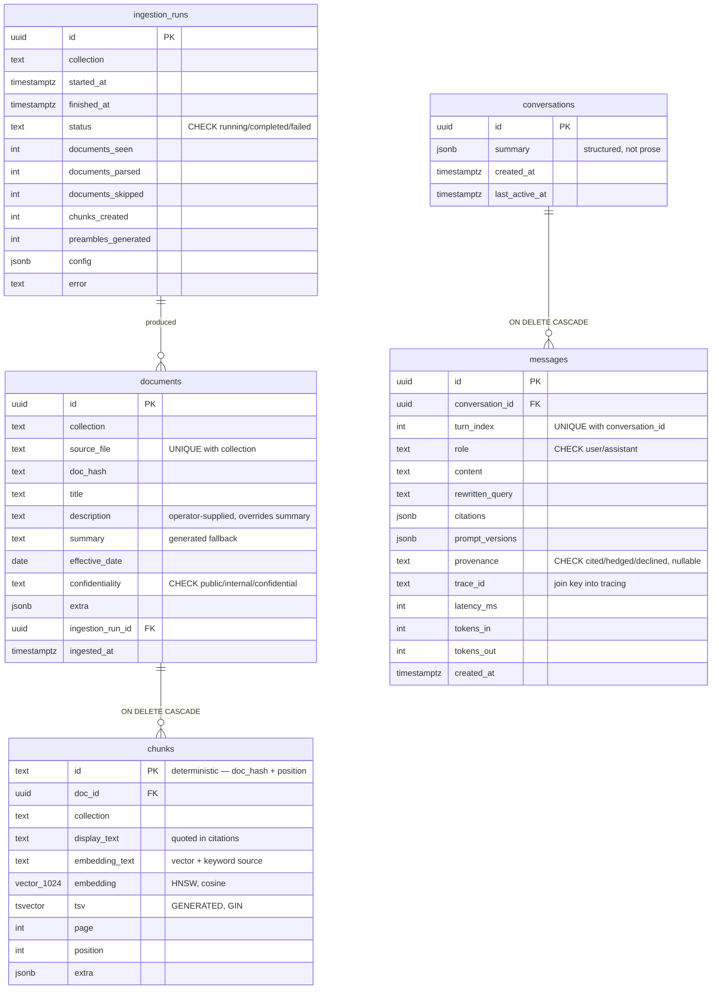

# Storage & Schema — Build Record

> The third phase of the build: the schema, the shared contracts every later phase codes against, and
> a fixture corpus that lets retrieval get built without waiting for ingestion.
>
> This document records what was built, how each component was *verified* rather than assumed, and
> what went wrong along the way. The design documents say what should be built; this says what was.

---

## 1. What this phase covers

Satisfies requirement 2.6 (indexing) and provides the storage authority every later phase reads and
writes through — [02b-pgvector-postgresql.md](../components/02b-pgvector-postgresql.md) is the schema
design; this is that schema, actually created and proven.

| Area | Delivers | Status |
|---|---|---|
| Shared contracts | `Chunk`, `Document`, `Passage`, `Plan`, `Turn`, `Citation` — the vocabulary every later phase imports | ✅ |
| Migrations | Five tables, HNSW + GIN indexes, all reversible | ✅ |
| Fixture corpus | 25 hand-authored chunks with real embeddings, committed | ✅ |
| Repository layer | Session management, atomic writes, conversation persistence | ✅ |

### Explicit non-goals

- **No ingestion pipeline** — a later phase. The fixture corpus exists specifically so retrieval does
  not have to wait for it
- **No retrieval queries** — this phase provides the primitives (indexes, the hybrid-search columns);
  the search logic itself is a later phase
- **No retention policy** — the periods for conversations and run records are still undecided

---

## 2. Complete schema reference

Pulled directly from the live database (`\d+` on each table), not reconstructed from the migration
source — this is what actually exists, not what was intended to exist.

### 2.1 Entity relationship diagram



**What each table holds, in one line:**

| Table | Holds |
|---|---|
| `ingestion_runs` | One row per ingestion attempt — what configuration produced the current index, so "what changed?" is a lookup |
| `documents` | One row per source file — title, operator-supplied metadata, and everything true of the *whole* document |
| `chunks` | The retrievable units — both text representations, the vector, the keyword index, never document-level facts |
| `conversations` | One row per chat session — a rolling structured summary, not the messages themselves |
| `messages` | One row per turn — content, citations, provenance, and the trace_id that joins to observability |

### 2.2 Relationships

| From | To | On delete | Meaning |
|---|---|---|---|
| `documents.ingestion_run_id` | `ingestion_runs.id` | *(restrict — default)* | Every document traces to the run that produced it |
| `chunks.doc_id` | `documents.id` | **CASCADE** | Deleting a document removes its chunks — makes re-ingestion's delete-then-insert atomic by construction |
| `messages.conversation_id` | `conversations.id` | **CASCADE** | Deleting a conversation removes its turns |

⚠️ Only two of the three relationships cascade. `documents → ingestion_runs` deliberately does **not**
— a run record is a reproducibility log; it should not vanish because someone deleted a document that
happened to reference it, and nothing in the design calls for it to.

### 2.3 Constraints, in full

| Table | Constraint | Type | What it enforces |
|---|---|---|---|
| `ingestion_runs` | `ingestion_runs_pkey` | PRIMARY KEY | `id` |
| `ingestion_runs` | `ck_ingestion_runs_status` | CHECK | `status IN ('running','completed','failed')` |
| `documents` | `documents_pkey` | PRIMARY KEY | `id` |
| `documents` | `uq_documents_collection_source_file` | UNIQUE | `(collection, source_file)` — the re-ingestion detection key |
| `documents` | `ck_documents_confidentiality` | CHECK | `confidentiality IN ('public','internal','confidential')` |
| `documents` | `documents_ingestion_run_id_fkey` | FOREIGN KEY | `ingestion_run_id → ingestion_runs.id` |
| `chunks` | `chunks_pkey` | PRIMARY KEY | `id` (deterministic, not server-generated) |
| `chunks` | `chunks_doc_id_fkey` | FOREIGN KEY | `doc_id → documents.id`, **ON DELETE CASCADE** |
| `conversations` | `conversations_pkey` | PRIMARY KEY | `id` |
| `messages` | `messages_pkey` | PRIMARY KEY | `id` |
| `messages` | `uq_messages_conversation_turn` | UNIQUE | `(conversation_id, turn_index)` — no two turns share an index |
| `messages` | `ck_messages_role` | CHECK | `role IN ('user','assistant')` |
| `messages` | `ck_messages_provenance` | CHECK | `provenance IS NULL OR provenance IN ('cited','hedged','declined')` |
| `messages` | `messages_conversation_id_fkey` | FOREIGN KEY | `conversation_id → conversations.id`, **ON DELETE CASCADE** |

**Why `CHECK` on a `text` column, not a Postgres `ENUM` type**, for every one of the four
constrained fields above (`status`, `confidentiality`, `role`, `provenance`): adding a new allowed
value later is an `ALTER CONSTRAINT`, not the more disruptive `ALTER TYPE ... ADD VALUE`, which cannot
run inside a transaction on older Postgres versions and cannot be undone at all.

### 2.4 Indexes, beyond the primary keys

| Table | Index | Method | Parameters |
|---|---|---|---|
| `chunks` | `ix_chunks_embedding_hnsw` | HNSW | `vector_cosine_ops`, `m=16`, `ef_construction=64` |
| `chunks` | `ix_chunks_tsv_gin` | GIN | on `tsv` |
| *(session-level)* | `hnsw.ef_search` | — | `100`, database default via `ALTER DATABASE`; overridable per-session |

### 2.5 Generated and computed values

| Table.Column | Rule |
|---|---|
| `ingestion_runs.id`, `documents.id`, `conversations.id`, `messages.id` | `gen_random_uuid()` — server-generated, no extension required (built into Postgres 13+) |
| `chunks.id` | **Not** server-generated — computed in application code from `doc_hash` + `position`, so it stays reproducible across re-ingestion and cache lookups |
| `chunks.tsv` | `GENERATED ALWAYS AS (to_tsvector('english', embedding_text)) STORED` — cannot drift from `embedding_text`, because the database recomputes it, not application code |
| `*.created_at` / `*.started_at` / `*.ingested_at` | `now()` at the database, not the application clock — one clock, not two that can disagree |

### 2.6 The governing rule this schema encodes

> **Chunks carry chunk-level facts only.** Anything true of the whole document — filename, hash,
> title, summary — lives on `documents` and is reached by join. Anything derivable from stored columns
> is derived, not stored.

Concretely: `source_file` and `doc_hash` are **not** repeated on every chunk; a chunk's neighbours are
found via `(doc_id, position)`, which already identifies them, rather than stored as explicit links.

---

## 3. Components: steps executed and how each was verified

Same rule as every phase before this one: **a step ends in a demonstration, not a claim.**

### 3.1 Shared contracts

**Why this came first.** Everything downstream — the write path, the read path, the API layer, the
evaluation harness — imports these shapes and nothing else. Two independently-built pieces inventing
incompatible shapes for the same object is the actual risk in a system meant to be built in parallel,
not the order dependencies are worked in.

**Steps**

```python
# app/shared/types.py — dataclasses only, no ORM, no web framework
Chunk, Document, IngestionRun  # write path
Passage, Plan, Citation, Turn  # read path
```

**Verified**

```bash
uv run pytest tests/unit/test_types.py -v
```

```
11 passed
```

Covers: zero ORM/web-framework imports, checked at the **source level** via `ast.parse` — not "did
importing it work in this process," which could pass by accident if something else already pulled
sqlalchemy into `sys.modules` first. `Chunk` rejects an empty `display_text` or `embedding_text`.
`Plan` enforces the sub-question cap. `Citation`'s merge key is `(source_file, page)`, not `chunk_id`.

### 3.2 Migrations

**Steps**

```bash
uv run alembic init -t generic migrations
# env.py wired to app.shared.config, not a second hardcoded connection string
uv run alembic revision -m "documents and ingestion_runs"
uv run alembic revision -m "chunks"
uv run alembic revision -m "indexes"
uv run alembic revision -m "conversations and messages"
```

**Verified — the full chain, not just "upgrade succeeded":**

```bash
uv run alembic upgrade head
uv run alembic downgrade base    # tables gone — confirmed via \dt
uv run alembic upgrade head      # back, confirmed via \dt
uv run alembic upgrade head      # idempotent — no-op, confirmed by empty output
```

```
Running downgrade d1dee9d9691a -> 612412f057e9 -> 1875ce8d9864 -> 08ec5ab1ec62 -> (base)
Running upgrade  (base) -> 08ec5ab1ec62 -> 1875ce8d9864 -> 612412f057e9 -> d1dee9d9691a
```

> **`env.py` uses `db.url` (`postgresql+psycopg://`), not `db.sync_url` (plain `postgresql://`).** The
> bare form defaults to the psycopg2 dialect, which this project never installs — only psycopg3 is a
> dependency. `create_engine()` would fail trying to import a driver that isn't there.

### 3.3 `documents` and `ingestion_runs`

**Verified**

```sql
\d documents
```

Matches the design exactly: `description`/`summary` as two separate columns (supplied overrides
generated, never conflated), `confidentiality` with a `CHECK` constraint, `extra jsonb` for anything
corpus-specific, and `UNIQUE (collection, source_file)` — the constraint re-ingestion detection
depends on.

### 3.4 `chunks`

**Steps**

```python
sa.Column("embedding", Vector(1024), nullable=True)
sa.Column("tsv", TSVECTOR(), sa.Computed("to_tsvector('english', embedding_text)", persisted=True))
sa.ForeignKey("documents.id", ondelete="CASCADE")
```

**Verified — with real data, not an empty schema check:**

```sql
INSERT INTO chunks (..., embedding, ...) VALUES (..., array_fill(0.001::real, ARRAY[1024])::vector, ...);

SELECT id, tsv FROM chunks WHERE id = 'chunk-1';
-- 'chunk-1' | '23kg':7 'allow':5 'baggag':1,4 'check':3 'polici':2

SELECT vector_dims(embedding) FROM chunks WHERE id = 'chunk-1';
-- 1024

DELETE FROM documents WHERE id = '...';
SELECT count(*) FROM chunks WHERE id = 'chunk-1';
-- 0
```

Three separate properties proven in one pass: `tsv` generates automatically with correct English
stemming (`baggage` → `baggag`, `policy` → `polici`), the embedding round-trips at exactly 1024
dimensions, and the cascade removes the chunk with zero orphans when its document is deleted.

### 3.5 Indexes

**Steps**

```sql
CREATE INDEX ix_chunks_embedding_hnsw ON chunks USING hnsw (embedding vector_cosine_ops)
  WITH (m = 16, ef_construction = 64);
ALTER DATABASE rag SET hnsw.ef_search = 100;   -- a safety net, not the only place this is set
CREATE INDEX ix_chunks_tsv_gin ON chunks USING gin (tsv);
```

**Verified**

At 500 seeded rows, the planner correctly chose a sequential scan — genuinely cheaper at that size, not
a defect. The actual risk the design calls out is an **operator mismatch** producing a permanent,
silent seq scan regardless of scale. Proved the index is structurally correct with the standard DBA
technique — force-disable seq scan and confirm the planner *can* satisfy the query via the index:

```sql
SET enable_seqscan = off;
EXPLAIN (ANALYZE, BUFFERS) SELECT ... ORDER BY embedding <=> $1 LIMIT 20;
```

```
Index Scan using ix_chunks_embedding_hnsw on chunks
  Order By: (embedding <=> $0)
```

Same technique for the keyword half:

```
Bitmap Heap Scan on chunks
  -> Bitmap Index Scan on ix_chunks_tsv_gin
```

```bash
SHOW hnsw.ef_search;   # 100, confirmed on a FRESH connection — ALTER DATABASE
                       # only affects sessions opened after it runs, not the one that ran it
```

### 3.6 `conversations` and `messages`

**Verified**

```sql
INSERT INTO messages (conversation_id, turn_index, ...) VALUES (..., 1, ...);
INSERT INTO messages (conversation_id, turn_index, ...) VALUES (..., 1, ...);  -- duplicate
```

```
ERROR:  duplicate key value violates unique constraint "uq_messages_conversation_turn"
```

The constraint that keeps turn ordering meaningful rejects exactly what it's supposed to.

### 3.7 Fixture corpus

**Why hand-authored, not extracted.** The real PDF corpus exists in `data/raw/`, but Docling doesn't
run until a later phase. Retrieval needs chunks to develop against *now* — hand-authoring them is what
lets that happen without a false dependency on ingestion being finished first.

**Steps**

```python
# tests/fixtures/fixture_chunks.py — 25 chunks, 8 documents, 2 collections
# deliberately includes:
#   - a near-duplicate PAIR (excess baggage fees, worded differently in two documents)
#   - rare tokens (clause "9.1", route "ABZ", form reference "EY360A")
```

```bash
uv run python -m tests.fixtures.generate_embeddings   # real bge-m3, run ONCE, committed
uv run python -m app.shared.store.seed                # never calls Ollama
```

**Verified**

```bash
uv run pytest tests/integration/test_seed.py -v
```

```
test_seed_loads_several_dozen_chunks_across_documents_and_collections   PASSED
test_seeding_twice_is_idempotent                                       PASSED
test_seeded_chunks_carry_real_1024_dimension_embeddings                PASSED
test_near_duplicate_pair_is_closer_than_unrelated_chunks               PASSED
test_rare_token_is_findable_by_keyword_search                          PASSED
```

The last two are what make this more than a row count. Querying for the nearest neighbour of the
"excess baggage fees" chunk returns the intended near-duplicate from a *different* document as the
closest match after itself; querying `EY360A` by keyword returns exactly the two dangerous-goods
chunks that reference it, nothing else.

### 3.8 Repository layer

**Steps**

```python
# app/shared/store/repository.py — plain SQL via SQLAlchemy Core, no ORM
write_document_with_chunks(session, document, chunks)  # delete-then-insert, one transaction
get_or_create_conversation(session, conversation_id)
write_turn(session, turn)
get_recent_turns(session, conversation_id, limit)
```

> **No ORM models.** `migrations/env.py` sets `target_metadata = None` deliberately — an ORM layer
> would mirror the schema a second time, and the two would drift. Migrations are the only schema
> definition; this module only talks to it.

**Verified — the acceptance criterion that matters most in this phase:**

```python
# a chunk with a doc_id that does not reference the document being written,
# forcing a foreign-key failure inside the same write
with pytest.raises(DBAPIError), get_session() as session:
    write_document_with_chunks(session, document, broken_chunks)
```

```bash
uv run pytest tests/integration/test_repository.py -v
```

```
test_write_then_read_round_trip                              PASSED
test_reingesting_the_same_source_replaces_old_chunks          PASSED
test_a_failure_partway_through_leaves_nothing_committed       PASSED
test_conversation_and_turn_round_trip                         PASSED
test_get_or_create_conversation_is_idempotent                 PASSED
```

The document is confirmed **absent** after the forced failure — atomicity proven, not assumed from
reading the code.

---

## 4. Challenges and how they were resolved

### 4.1 `f1xed` is not a valid UUID

The fixture ingestion run was first given the id `00000000-0000-0000-0000-0000000f1xed` — memorable,
and invalid: UUIDs are hex-only, and `x` is not a hex digit. Caught before the first seed run by
reading the string back rather than trusting it. Fixed to `...feed0`.

### 4.2 Idempotent seeding needed an upsert, not a plain insert

The fixture run reuses one fixed id on every call, by design — but `create_ingestion_run` originally
did a plain `INSERT`, which fails with a primary-key violation on the second run. Real callers always
pass a fresh random id, so this never fires for them; only the fixture path deliberately collides.
Fixed with `ON CONFLICT (id) DO UPDATE`.

### 4.3 ⚠️ Two tests failed only as part of the full suite — never alone

```
tests/integration/test_seed.py::test_seeding_twice_is_idempotent
tests/integration/test_seed.py::test_seeded_chunks_carry_real_1024_dimension_embeddings
```

Both passed reliably on their own and failed reliably in the full run — the signature of shared,
mutable state, not flakiness. `test_repository.py`'s tests wrote real rows into `documents` and
`chunks` and never cleaned them up; `test_seed.py`'s assertions used an **unscoped** `SELECT count(*)
FROM chunks` and a bare `LIMIT 1` with no `WHERE` or `ORDER BY` — "some row, could belong to anyone."

```
assert first_count == second_count == len(CHUNKS)
AssertionError: assert 27 == 25
```

Two leftover rows from the repository tests were exactly the difference. Fixed in both directions,
deliberately, rather than picking one:

- **Proper teardown** added to `test_repository.py`'s fixture — deletes its own `collection = 'test'`
  rows afterward
- **Scoped assertions** in `test_seed.py` — filtered to the fixture's own known chunk ids, so it
  cannot be fooled by whatever else exists in the table regardless of any other test's hygiene

Confirmed with **three consecutive full-suite runs** afterward, not one — the same standard applied to
the tracing race condition in the previous phase.

---

## 5. Final state

```
SCHEMA          five tables — documents, ingestion_runs, chunks, conversations, messages
                migration chain: 4 revisions, fully reversible, idempotent at head

INDEXES         HNSW (vector_cosine_ops) — confirmed via EXPLAIN, not assumed
                GIN (tsv) — confirmed via EXPLAIN
                ef_search=100 confirmed on a FRESH connection

FIXTURES        25 chunks · 8 documents · 2 collections · real 1024-dim embeddings
                committed — seeding needs no model at runtime

TESTS           46 passed — 3 consecutive full-suite runs, zero flakes

QUALITY         ruff clean · ruff format clean · mypy strict clean
```

---

## 6. What this unblocks

Retrieval can now be built entirely against the fixture corpus — real vectors, real keyword index, a
deliberate near-duplicate pair and rare tokens to prove hybrid search actually does what it claims —
without waiting for the ingestion pipeline that produces real corpus data. Every later phase that
writes a document, a chunk, or a conversation turn does so through the repository layer proven here,
not by inventing its own SQL.

---

## 7. Command reference

```bash
uv run alembic upgrade head                              # apply migrations, idempotent
uv run alembic downgrade base                             # drop everything (dev only)
uv run python -m tests.fixtures.generate_embeddings        # regenerate committed embeddings
                                                             # (only when fixture_chunks.py changes)
make seed                                                   # load the fixture corpus
uv run pytest tests/unit/test_types.py -v
uv run pytest tests/integration/test_seed.py tests/integration/test_repository.py -v
uv run pytest -q                                            # everything
```
