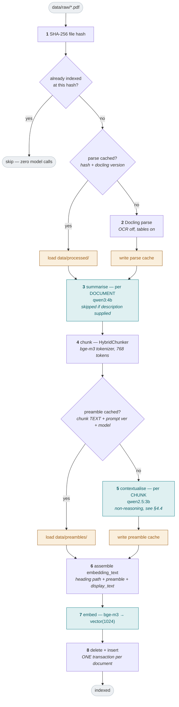

# Ingestion — Build Record

> The fourth phase of the build: PDFs become searchable chunks. The whole write
> path, end to end.
>
> This document records what was built, how each component was *verified* rather
> than assumed, and what went wrong along the way. The design documents say what
> should be built; this says what was.

---

## 1. What this phase covers

Satisfies requirement 2.6 (ingestion workflow) and the write half of three
baseline items: **Docling** (parsing), **Contextual RAG** (preambles), and
**Ollama** (summarisation and embedding).

| Area | Delivers | Status |
|---|---|---|
| File identity | SHA-256 content hash, de-duplication, parse cache | ✅ |
| Parse | Docling with OCR off and table structure on | ✅ |
| Summarise | One call per document, skipped when a description was supplied | ✅ |
| Chunk | HybridChunker with the embedding model's own tokenizer | ✅ |
| Contextualise | One call per chunk, cached on chunk text | ✅ |
| Embed + write | Batched by model, one transaction per document | ✅ |
| CLI + run record | `make ingest`, full `ingestion_runs` row | ✅ |

### Explicit non-goals

- **No OCR** — deliberately disabled; see §4.1. Scanned or image-only content is
  out of scope per doc/components/01-docling.md
- **No non-PDF formats**
- **No upload endpoint** — a later phase. This phase ships the CLI, which the
  design requires regardless: the engine must be callable without HTTP
- **No Celery task** — same reason; the task will be a thin wrapper over the same
  `ingest_collection` function

---

## 2. The pipeline



### Batched by model, in four phases

⚠️ Stages run across the **whole run**, not per document: all summaries, then all
preambles, then all embeddings, then all writes. Interleaving per chunk would
swap models in and out of memory hundreds of times — producing correct output the
entire time, with nothing to signal why a twenty-minute run took fourteen hours.

### The write path does not fail forward

Unlike the read path, which degrades rather than errors, a failure here marks the
run `failed`. A half-ingested document is worse than an absent one: searchable,
incomplete, and indistinguishable from a complete one.

---

## 3. Components: steps executed and how each was verified

### 3.1 File identity and de-duplication

**Steps** — SHA-256 over file *contents*, not filename. A renamed-but-unchanged
file is the same document; a changed-but-identically-named file is not.

**Verified** — re-running ingestion over an unchanged corpus:

```
status=completed seen=2 parsed=0 skipped=2 chunks=0 preambles=0
```

Zero model calls, near-instant instead of ~13 minutes.

### 3.2 Parse

**Steps**

```python
pipeline_options.do_ocr = False  # see §4.1 — the default is True
pipeline_options.do_table_structure = True
```

Parse cache at `data/processed/<hash>__<docling-version>.json`. The version is
part of the key because a Docling upgrade can change how a PDF parses, and
silently serving a stale structure across a version bump would be invisible.

**Verified** — JSON round-trip is exact:

```python
DoclingDocument.load_from_json(path).export_to_markdown() == doc.export_to_markdown()
# True
```

Table extraction confirmed on real content: a two-page, table-only document
serialised to 3,833 characters of pipe-delimited table text.

### 3.3 Summarise

**Steps** — one `qwen3:4b` call per document from title + heading tree + first
~2 pages. Skipped entirely when the operator supplied a description; supplied
metadata is authoritative and cannot be improved by inference.

**Verified** — see §4.2, which is where the interesting part is.

### 3.4 Chunk

**Steps** — `HybridChunker` with `HuggingFaceTokenizer.from_pretrained("BAAI/bge-m3", max_tokens=768)`,
`merge_peers=True`, minimum 100 characters.

**Verified**

```
5 chunks from tsa-travel-checklist.pdf
  headings: ['Before Packing'] / ['When Packing'] / ['Before Leaving for the Airport'] ...
  page numbers resolved from doc_items[0].prov[0].page_no
```

`chunk_id` is deterministic — `doc_hash` + zero-padded position, nothing
content-derived:

```python
ParsedChunk(doc_hash="h", position=7, page=1,  ...).chunk_id == "h__007"
ParsedChunk(doc_hash="h", position=7, page=99, ...).chunk_id == "h__007"   # same
```

### 3.5 Contextualise

**Steps** — one `qwen2.5:3b` call per chunk (a *non-reasoning* model — see §4.4
for why this is not `small_model`). Cache keyed on **chunk text + prompt
version + model name** — deliberately *not* position or chunk_id, so retuning
chunk size does not discard the corpus's preambles.

**Verified** — forced full re-ingestion after deleting the document rows:

```
elapsed: 50.3s        (first run: ~13 min)
parsed=2 chunks=17 preambles=17
preambles cached before: 17   after: 17     ← every one a cache hit, zero model calls
```

**~15× faster**, which is the difference the cache exists to make. Sample output,
showing the preamble situating a chunk that would be meaningless alone:

```
The In Standard Screening Lane section of the TSA travel checklist for U.S.
airport security screening specifies the steps.
```

### 3.6 Embed and write

**Verified** — `display_text` and `embedding_text` confirmed distinct in the
database, with the preamble *wrapping* the original rather than replacing it:

```
display_text   | Alcoholic beverages exceeding 70% by volume, FORBIDDEN = FORBIDDEN. ...
embedding_text | Etihad's dangerous goods handling procedures list prohibited items.
               | Alcoholic beverages exceeding 70% by volume, FORBIDDEN = FORBIDDEN. ...
```

All chunks carry `vector_dims(embedding) = 1024`.

### 3.7 CLI and run record

**Verified** — smoke test over two real PDFs:

```
status: completed
seen: 2   parsed: 2   skipped: 0
chunks: 17   preambles: 17
```

The `ingestion_runs` row matched exactly, and both documents landed with
accurate, content-derived summaries.

### 3.8 Corpus measurement

Parse + chunk over all nine real documents — **no model calls**, so this doubles
as warming the parse cache the real run needs:

| Document | Pages | Chunks |
|---|---|---|
| delta-contract-of-carriage-domestic | 23 | 96 |
| delta-contract-of-carriage-international | 31 | 127 |
| etihad-axa-travel-insurance-policy | 19 | 115 |
| etihad-cargo-conditions-of-carriage | 14 | 63 |
| etihad-dangerous-goods-guide | 2 | 12 |
| etihad-general-conditions-of-carriage-previous | 69 | 70 |
| etihad-general-conditions-of-carriage | 69 | 72 |
| etihad-prohibited-items | 21 | 29 |
| tsa-travel-checklist | 2 | 5 |
| **TOTAL** | **250** | **589** |

Parse + chunk for the whole corpus: **140 seconds**.

> Worth noting: the two 69-page Etihad documents yield *fewer* chunks (70, 72)
> than the 23-page Delta contract (96). They are print-to-PDF web pages with
> heavy whitespace and navigation; Delta's are dense legal text. Page count is a
> poor proxy for corpus size.

---

## 4. Challenges and how they were resolved

### 4.1 Two library defaults that contradict the design, both silent

Caught by **inspecting the installed libraries** rather than trusting the
documented intent — neither would have raised an error.

| Default | Reality | Consequence if left |
|---|---|---|
| `PdfPipelineOptions.do_ocr` | **`True`** | Every parse loads RapidOCR and spends time on it, contradicting the documented out-of-scope decision |
| `HybridChunker()` tokenizer | **`sentence-transformers/all-MiniLM-L6-v2`** | Chunks sized to a *different* model's token boundaries than `bge-m3`, forever, with no error |

The second is the more insidious: chunk sizing would simply have been wrong,
producing a subtly worse corpus that no test would flag.

### 4.2 ⚠️ The summariser was reading filenames, not documents

The most consequential bug in this phase, and it looked like working software.

The dangerous-goods guide produced this summary:

> "Etihad's dangerous goods handling procedures. This guide applies to Etihad's
> operations and…"

Accurate. Plausible. And generated from **nothing**:

```
heading_tree     : 0 chars -> ''
first_pages_text : 0 chars -> ''
```

**Root cause.** A Docling table item has **no `.text` attribute at all**. The
extraction helper filtered on `getattr(item, "text", None)`, so it skipped every
table silently. That document is 3 tables and 2 pictures with **zero text
items** — so the summariser received an empty string and inferred a summary from
the only input left: the filename.

**Why it mattered more than it appeared.** The document summary is the input to
*every* chunk's contextual preamble. All 12 chunks were contextualised from a
filename-derived guess. Had the file been named `EY360A_Rev3.pdf`, the summary
would have been garbage — and equally silent. The corpus was *deliberately
chosen* to be table-heavy, so this would have affected many documents.

**Fix** — handle tables via `export_to_markdown()`, exclude pictures (whose
serialisation is a placeholder telling you to enable image generation — noise in
a prompt), and cap the total at 12,000 characters since a 69-page document's
"first two pages" is otherwise unbounded.

| | Before | After |
|---|---|---|
| Table-only document | **0 chars** | **12,001 chars** |
| Text document | 2,740 chars | 2,644 chars (picture noise removed) |

**Verified by content, not by length.** The regenerated summary:

> "Etihad Airways' dangerous goods rules for passenger air travel. … details
> prohibited items in carry-on baggage with specific allowances for **alcohol,
> batteries, and avalanche gear**."

"Avalanche gear" only exists inside the tables. That phrase is the proof the fix
works — it could not have been guessed from a filename.

### 4.3 The heading_path that looked like a bug and was not

All 12 chunks from the dangerous-goods guide had an empty `heading_path`, while
all 5 TSA chunks had correct ones. Investigated rather than assumed:

```
=== label counts: dangerous-goods guide ===
  table      3
  picture    2
```

Zero headings exist in that document, so an empty `heading_path` is correct. No
fix needed — and the contextual preamble compensates, which is the contextual
retrieval design working as intended.

⚠️ **But the check that first "confirmed" this was itself broken.** It searched
for `'heading'` in the label name — and the real label is `section_header`, which
contains `header`, not `heading`. It would have reported "no headings" for *any*
document. The conclusion was right; the reasoning was worthless. Re-verified
properly with `DocItemLabel.TITLE` / `DocItemLabel.SECTION_HEADER`.

### 4.4 ⚠️ The wrong model for the job — a 32-hour corpus run

The design assigned contextualisation to `qwen3:4b`. That was an error, and it
made ingestion infeasible rather than merely slow.

**First symptom.** Preambles were taking ~15s each to produce one sentence:

```
response   : 'Most airlines charge a fee for checked baggage exceeding 23 kilograms.'  (70 chars)
thinking   : 'Okay, the user wants me to write ONE short sentence...'
eval_count : 453 tokens generated
```

**453 tokens for a 70-character answer.** qwen3 is a *reasoning* model with
thinking on by default, so ingestion paid for hidden chain-of-thought on every
chunk.

**And it got far worse on real content.** The 15s figure came from a short test
chunk. Measured on an actual 3,384-character chunk from the Delta contract:

```
prompt_eval_count :   621 tokens
eval_count        : 5,684 tokens     ← to write one sentence
wall              : 194.2s
```

589 chunks × 194s = **~32 hours** for one corpus.

**Every attempt to disable thinking failed.** All measured, none usable:

| Approach | Wall | Tokens | Outcome |
|---|---|---|---|
| default | 194.2s | 5,684 | infeasible |
| `/no_think` prefix | 194.0s | 5,722 | ⚠️ **no effect** at real chunk size (it had appeared to help on a tiny test chunk) |
| `/api/generate` + `think: false` | — | 453 | ⚠️ reasoning leaked *into* `response` |
| `/api/chat` + `think: false` | 157.3s | 4,531 | ⚠️ same leak — response began "We are given: - Document summary…" |

The two `think: false` variants are the dangerous ones: they do not stop the
reasoning, they just stop *separating* it, so the meta-commentary would have
become the preamble text itself.

**Fix: a separate, non-reasoning model for contextualisation.** Contextualisation
is the highest-volume call in the system — one per chunk — and the task is
mechanical. Reasoning buys nothing. `summarise` and `verify` keep `qwen3:4b`,
where volume is low (9 calls and one per answer) and reasoning is plausibly
useful.

```python
small_model: "qwen3:4b"  # summarise, verify — low volume
contextualiser_model: "qwen2.5:3b"  # contextualise  — 589 calls, non-reasoning
```

**Verified on the three *largest* chunks in the corpus** — worst case, not a
favourable sample:

| | qwen3:4b | qwen2.5:3b |
|---|---|---|
| Per chunk | ~194s | **2.4s** |
| Full corpus (589 chunks) | ~32 hours | **~24 minutes** |

**~80× faster**, with output that genuinely situates the chunk — correctly
naming "Rule 17 in the section on Schedules and Operations", ticket
validity/transferability terms, and the Carrier definition.

Two supporting changes:

- **The model name is part of the preamble cache key**, so the switch correctly
  invalidated the 24 preambles qwen3:4b had produced rather than serving a
  silent mix of two models' output.
- **`num_predict: 200`** added as a guard, not a tuning knob. A situating
  sentence needs ~60 tokens; if a future model starts rambling, the cost is
  bounded instead of quietly becoming hours again.

> **The lesson.** "Small model for cheap work" was the right instinct, but
> *small* and *non-reasoning* are different axes, and the design conflated them.
> A 4B reasoning model is far more expensive per call than an 8B instruct model
> for a task like this.

⚠️ One item left open: the new preambles open with "This passage…", which the
prompt explicitly forbids. Cosmetic, and not worth blocking a corpus run over —
recorded for prompt refinement rather than silently accepted.

### 4.5 A measurement contaminated by its own observer

An initial timing run reported **141.9s per preamble** — which would have implied
a ~13-hour corpus run and reshaped the whole plan. It was wrong: concurrent
`curl` probes were queued against the same Ollama instance, which serialises
requests (`OLLAMA_NUM_PARALLEL=1`). Re-measured with nothing else running:
**~12–15s**. Nearly a 10× error, entirely self-inflicted.

The lesson is the same one §4.3 taught in a different form: a number produced by
a flawed method is worse than no number, because it gets acted on.

---

## 5. Final state

```
MODULES     parse · summarise · chunk · contextualise · index · pipeline · cli
            lint clean · ruff format clean · mypy strict clean

VERIFIED    smoke test: 2 real PDFs -> 17 chunks, correct content-derived summaries
            de-duplication: re-run = 0 parsed, 2 skipped, 0 model calls
            preamble cache: forced re-ingest 50s vs ~13min (~15x), all cache hits
            display_text / embedding_text confirmed distinct in the database
            all embeddings vector_dims = 1024

CORPUS      9 documents · 250 pages · 589 chunks
            parse cache warm for all 9

TESTS       51 passed (5 new regression tests in this phase)
```

**In flight at time of writing:** full-corpus ingestion into collection `corpus`,
estimated ~2.5 hours (589 preambles at ~15s). Deliberately a *separate*
collection from the fixture corpus in `default`/`cargo`, so retrieval work can
continue against stable fixtures while it runs.

---

## 6. What this unblocks

Retrieval no longer depends on fixtures alone — once the corpus run completes,
there is real, chunked, embedded content from nine genuine airline policy
documents to search against, including the dense tables and numbered clauses the
corpus was chosen for.

The pipeline is also already callable three ways from one implementation, which
is what later phases need: as a CLI (now), as a Celery task, and directly from
the evaluation harness — because `app/engine/` never imports the web framework.

---

## 7. The corpus, and what ingesting it actually cost

### 7.1 What is in the corpus and why

Nine documents, chosen to stress the pipeline rather than to be easy. Six are
genuine Etihad documents; three are deliberate stand-ins (Delta, TSA) because
Etihad's passenger conditions of carriage sit behind bot protection that blocked
automated download — see doc/01-problem-statement.md §7.1 on the corpus-agnostic
position.

| Document | Pages | Size | Chunks | Avg chunk | Why it is in the corpus |
|---|---|---|---|---|---|
| `delta-contract-of-carriage-international.pdf` | 31 | 444 KB | **127** | 886 ch | Densest legal prose in the set |
| `etihad-axa-travel-insurance-policy.pdf` | 19 | 239 KB | **115** | 620 ch | Policy tables, defined terms |
| `delta-contract-of-carriage-domestic.pdf` | 23 | 331 KB | **96** | 799 ch | Numbered rules, cross-references |
| `etihad-general-conditions-of-carriage.pdf` | 69 | 4.2 MB | **72** | 1,620 ch | The headline document — passenger COC |
| `etihad-general-conditions-of-carriage-previous.pdf` | 69 | 4.2 MB | **70** | 1,668 ch | **Superseded version** of the above — for testing version/recency handling |
| `etihad-cargo-conditions-of-carriage.pdf` | 14 | 353 KB | **63** | 787 ch | Different domain (cargo, not passenger) — out-of-scope boundary testing |
| `etihad-prohibited-items.pdf` | 21 | 4.7 MB | **29** | 693 ch | Icon-heavy layout, sparse text |
| `etihad-dangerous-goods-guide.pdf` | 2 | 1.2 MB | **12** | 2,728 ch | **Table-only** — zero text items; the document that exposed §4.2 |
| `tsa-travel-checklist.pdf` | 2 | 83 KB | **5** | 531 ch | Short, different register, clean headings |
| **TOTAL** | **250** | **16 MB** | **589** | | |

Two pairs earn their place specifically:

- **The two 69-page conditions-of-carriage documents** are current and superseded
  versions of the same thing. Nearly identical content in two documents is what
  makes "which version applies?" a real retrieval problem rather than a
  hypothetical one.
- **The cargo document** is genuine Etihad content from an adjacent but *different*
  domain. It gives out-of-scope classification something plausible to reject,
  rather than only obviously-unrelated questions.

> ⚠️ **Page count is a poor proxy for corpus size.** The two 69-page Etihad
> documents yield *fewer* chunks (72, 70) than the 23-page Delta contract (96) —
> they are print-to-PDF web pages with heavy whitespace and navigation, while
> Delta's are dense legal text. The 2-page dangerous-goods guide has by far the
> largest average chunk (2,728 chars) because a serialised table does not break
> at natural boundaries.

### 7.2 Ingestion run metrics

```
collection          corpus
status              completed
documents_seen      9
documents_parsed    9
documents_skipped   0
chunks_created      589
preambles_generated 589
elapsed             18.2 minutes
```

| Stage | Cost | Notes |
|---|---|---|
| Parse + chunk (all 9) | **140 s** | No model calls; ~94 s of that was first-run model loading |
| Summarise | 9 calls | One per document, `qwen3:4b` |
| Contextualise | 589 calls | `qwen2.5:3b`, ~2.4 s each — see §4.4 |
| Embed | 589 calls | `bge-m3`, 1024 dimensions |
| **Total wall clock** | **18.2 min** | Beat the 24 min estimate |

**Caches on disk after the run:**

| Cache | Size | Contents |
|---|---|---|
| `data/processed/` | 3.1 MB | 9 parsed documents, keyed on hash + Docling version |
| `data/preambles/` | 2.1 MB | 613 files — 589 current + 24 orphaned from the qwen3 model switch |

The 24 orphans are worth noting rather than cleaning: the model name is part of
the cache key, so switching contextualiser correctly *invalidated* them rather
than silently serving a mix of two models' output. They cost 2 KB each and would
be reused if the model were ever switched back.

**Collections after ingestion** — the real corpus is deliberately separate from
the test fixtures, so retrieval development runs against stable data while
ingestion writes concurrently:

```
corpus     589      real documents
default     17      fixtures
cargo        8      fixtures
```

### 7.3 What this cost to get wrong

Worth recording alongside the final numbers, because the difference is the
entire value of measuring rather than estimating:

| | Projected | Actual |
|---|---|---|
| With `qwen3:4b` (as designed) | **~32 hours** | never run |
| With `qwen2.5:3b` (as corrected) | ~24 min | **18.2 min** |

---

## 8. Command reference

```bash
make ingest COLLECTION=corpus          # ingest data/raw into a collection

# de-duplication check — re-run should report parsed=0
make ingest COLLECTION=corpus

uv run pytest tests/integration/test_ingest_parse.py -v

# inspect the caches
ls data/processed/                      # <hash>__<docling-version>.json
ls data/preambles/ | wc -l              # one file per unique chunk text
```

| Cache | Keyed on | Invalidated by |
|---|---|---|
| `data/processed/` | file hash + Docling version | changing the file, or upgrading Docling |
| `data/preambles/` | chunk text + prompt version + model | editing the chunk-contextualizer prompt, or changing the model |
