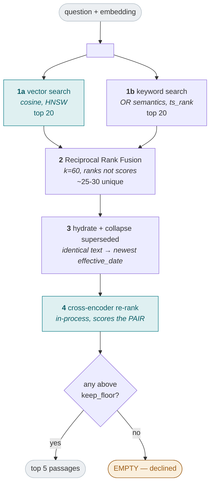

# Retrieval — Build Record

> The fifth phase of the build: a question becomes the handful of passages most
> likely to answer it. Everything up to, but not including, generation.
>
> This document records what was built, how each component was *verified* rather
> than assumed, and what went wrong along the way. The design documents say what
> should be built; this says what was.

---

## 1. What this phase covers

Satisfies the retrieval half of baseline item 2 (**LlamaIndex + PGVector**), and
supplies the evidence that requirement 2.1 (grounded answers) depends on —
including the ability to return *nothing*.

| Area | Delivers | Status |
|---|---|---|
| Vector search | Cosine via HNSW, filters inside the query | ✅ |
| Keyword search | OR semantics, `ts_rank` ordering | ✅ |
| Fusion | Reciprocal Rank Fusion, k=60, deterministic | ✅ |
| Re-ranking | Cross-encoder, in-process, with a score floor | ✅ |
| Search surface | `search()` with per-stage breakdown | ✅ |
| Recall measurement | Approximate vs exact, across `ef_search` | ✅ |
| Version supersession | Identical text collapses to newest `effective_date` | ✅ |

### Explicit non-goals

- **No query rewriting or decomposition** — the planner's job, a later phase.
  This phase takes a question exactly as given
- **No generation** — deliberately. Keeping retrieval callable on its own is how
  a bad answer gets attributed to *retrieval failed* versus *retrieval was fine
  and generation went wrong*
- **No HTTP endpoint** — `POST /search` arrives with the API phase; the engine
  function it will call is here

---

## 2. The pipeline



### Two stages, two different jobs

Retrieval **casts wide cheaply**; re-ranking **narrows accurately**. A bi-encoder
embeds question and passage separately and can be pre-computed at ingestion; a
cross-encoder scores the pair jointly and is markedly better at judging
relevance, but cannot be pre-computed. That is only affordable on a few dozen
candidates — which is exactly what fusion hands it.

### An empty result is an answer

`keep_floor` is what makes declining possible. Without it, the five least-bad
passages always come back and the synthesizer has no signal they are irrelevant
— it will write a confident answer from whatever it is given.

---

## 3. Components: steps executed and how each was verified

### 3.1 Vector search

**Steps** — cosine distance via `<=>`, matching the index's `vector_cosine_ops`
operator class. Filters composed **into** the SQL, never applied to its results.

**Verified**

```python
# phrased with none of the corpus's own vocabulary — semantic match only
await _embed("what does it cost to bring an extra suitcase?")
# -> top hit is fx-baggage-01__001 (the excess baggage fee chunk)
```

### 3.2 Keyword search

**Steps** — OR-joined `to_tsquery`, ordered by `ts_rank`.

**Verified — the trap the design singles out:**

```
"What is the checked baggage allowance for Economy passengers
 travelling from Abu Dhabi to London?"      → returns results, NOT zero
"EY360A"                                     → exactly {fx-dg-01__000, fx-dg-01__001}
```

> ⚠️ `plainto_tsquery` ANDs every term, so a long natural-language question
> matches nothing — **silently**, because vector search still returns results and
> the system appears to work while half of it is dead. A test asserts the
> non-zero case specifically.

### 3.3 Filters, applied identically to both halves

**Verified** — `collection='default'` and `collection='cargo'` each return only
their own chunks, asserted on **both** halves. A filter that drifts between them
means the two are searching different corpora and nothing reports it, so one
shared `to_sql()` builder serves both.

### 3.4 Reciprocal Rank Fusion

**Steps** — `score = Σ 1/(k + rank)`, k=60. Ranks, not scores: cosine distance
and `ts_rank` are on incomparable scales and `ts_rank` shifts with query length,
so weighted score arithmetic is meaningless.

**Verified**

```
appears in BOTH halves  >  ranks well in only one     ✅ agreement rewarded
duplicate across halves →  one entry                  ✅ deduplicated
identical scores        →  chunk_id ascending, stable ✅ deterministic
```

Tie-breaking on `chunk_id` matters: without it, identical inputs could produce
different orders across runs and no test could pin the ranking down.

### 3.5 Cross-encoder re-ranking

**Steps** — `BAAI/bge-reranker-v2-m3`, loaded once per process, running
**in-process** rather than on Ollama (a `sentence-transformers` model, a
different serving pattern — which is why "all models are in Ollama" is not quite
true).

**Verified — discrimination is near-total:**

```
("what is the excess baggage fee?", "Excess baggage fees apply per kilogram…")  → 0.969
("what is the excess baggage fee?", "Trained service animals are carried free…") → 0.000
```

Candidates supplied deliberately **worst-first**, so a passthrough
implementation would fail the ordering test.

**And the behaviour that matters most:**

```python
rerank("how do I repair a bicycle derailleur?", airline_passages, settings)
# -> []          not "the three least-bad airline passages"
```

**Degradation** — if the model cannot load, retrieval falls back to fusion order
rather than failing the request. The floor is *not* applied in that case: it is a
property of cross-encoder scores, and applying it to fusion ranks would be
meaningless. §4.1 covers why this graceful degradation nearly cost more than it
saved.

### 3.6 The search surface

**Steps** — `search()` returns a `SearchResult` carrying the per-half hits, the
fused ids, and `rejected_by_floor` alongside the final passages.

The breakdown is not decoration: when retrieval goes wrong the first question is
*which half failed*, and an opaque final list cannot answer it (requirement 3.2).

**Verified against the real 589-chunk corpus:**

| Question | Result |
|---|---|
| "can I bring a lithium battery in my carry-on?" | **0.978** → dangerous-goods guide |
| "what happens if my flight is cancelled?" | **0.924** → conditions of carriage |
| "what is the checked baggage allowance?" | **0.815** → baggage liability + allowances |
| "how do I bake sourdough bread?" | **DECLINED** — 20 candidates fused, all below floor |

The decline is the important row. It searched, found candidates, and rejected
every one — which is different from not searching.

### 3.7 Recall measurement

**Steps** — run each query twice: once through the index, once with index scans
disabled so Postgres falls back to a sequential scan, which is exact by
construction. Recall is the overlap.

**Verified** — and getting here took fixing two bugs in the measurement itself;
see §4.2.

| `ef_search` | mean recall@20 | worst | chunks missed |
|---|---|---|---|
| 1 | 0.050 | 0.00 | 152 |
| 4 | 0.194 | 0.05 | 129 |
| 10 | 0.500 | 0.35 | 80 |
| 40 | 0.994 | 0.95 | 1 |
| **100** ← configured | **0.994** | 0.95 | 1 |

⚠️ **At this corpus size, 40 and 100 are indistinguishable.** The configured 100
is not currently justified by data — it is cheap insurance against corpus growth,
and that is a different claim from "measured to be better". Worth re-measuring
once the corpus is an order of magnitude larger, which is when approximate
indexes quietly get worse.

### 3.8 Version supersession

**Steps** — where two passages carry byte-identical `display_text`, keep only the
one whose document has the most recent `effective_date`.

**Why it was needed** — measured, not assumed:

```
etihad-general-conditions-of-carriage.pdf           72 chunks
etihad-general-conditions-of-carriage-previous.pdf  70 chunks
BYTE-IDENTICAL BETWEEN THEM:                        50 chunks
```

Both versions retrieve, both score identically, and two of five result slots then
carry one slot's worth of information — **40% of what the synthesizer sees**,
spent on a duplicate.

**Verified** — same query, before and after:

| Slot | Before | After |
|---|---|---|
| #1 | COC-**previous** p60 (0.815) | COC-**current** p60 (0.815) — newest kept |
| #2 | COC-current p60 (0.815) — *duplicate* | Delta international p5 (0.751) — **slot recovered** |
| #4 | — | COC p35 — *the actual excess baggage charge clause* |

The recovered slot surfaced genuinely new information, and #4 is now the clause
that most directly answers the question.

The Delta domestic/international pair at #2–3 correctly **remains**: those are
different documents saying similar things, not two versions of one document.

> ⚠️ **NULL means "unknown", never "newest".** An undated document cannot
> displace a dated one, and two undated documents keep retrieval order. A corpus
> that never populates `effective_date` therefore behaves exactly as before,
> rather than silently reordering on a field nobody filled in.

---

## 4. Challenges and how they were resolved

Both of this phase's significant findings were bugs in **my own verification**,
not in the system under test. That is worth stating plainly: a broken test is
more dangerous than no test, because it converts "unknown" into "confirmed good".

### 4.1 Graceful degradation hid a programming error

The re-ranking tests failed on an unrelated assertion (`assert 0.0 > 0.0`), with
this in the captured log:

```
WARNING could not load re-ranker ('Settings' object has no attribute
        'reranker_model'); falling back to fusion order
```

I had passed the **top-level `Settings`** where `RetrievalSettings` was expected.
The module's designed-in graceful degradation caught the resulting `AttributeError`,
logged a warning, and quietly returned fusion order — so the test failed on a
downstream symptom rather than the actual cause.

This is the exact tension `doc/02-architecture.md` §7 warns about: *fail-forward
makes failures invisible*. Here it made a type error look like a scoring bug.

**Two fixes:**

- The immediate one: pass `settings.retrieval`.
- The structural one: **mypy now covers `tests/`, not just `app/`.** It would have
  caught this before the test ever ran. Cost: three `type: ignore[call-arg]`
  markers for pydantic-settings' `_env_file` runtime kwarg, and one `int()` cast.
  Cheap for the class of bug it closes.

### 4.2 ⚠️ A recall measurement that measured itself

The first recall run reported **1.000 at every `ef_search`, including 1** — which
is precisely what `doc/components/02b-pgvector-postgresql.md` §5 warns about:
a measurement that "always reports 100% because it is comparing something to
itself". Two independent bugs, both silent, both producing a number that looked
like proof the index was lossless.

**Bug one: the planner ignored the index.** At 589 chunks a sequential scan is
genuinely cheaper, so *both* sides of the comparison ran exact search. Confirmed
with `EXPLAIN` rather than reasoned about:

```
without forcing:  Seq Scan on chunks
forced:           Index Scan using ix_chunks_embedding_hnsw
```

Fixed by setting `enable_seqscan = off` on the approximate path — **required, not
an optimisation**.

**Bug two: `SET LOCAL` leaked between the two queries.** Both run on the same
session, and `SET LOCAL` persists for the whole transaction — so the "exact"
query inherited `enable_seqscan = off` *and* `hnsw.ef_search = 2` from the
approximate run. Both sides executed the same degraded index path.

The tell was in the output and I nearly missed it: **`exact` returned 4 rows for
a k of 20.** A genuine sequential scan over 589 chunks cannot return 4. Fixed by
explicitly `RESET`-ing the relevant GUCs at the start of each query.

Only after both fixes did the measurement discriminate — recall falling from
0.994 to 0.050 as `ef_search` drops, which is the evidence the design asked for.

> **The pattern across both findings, and across §4.2/§4.5 of the ingestion
> record:** every one was caught by an *unexpected number*, not by a failing
> assertion — 4 rows where 20 were due, 5,684 tokens for one sentence, 194s per
> chunk. Assertions catch what you thought to check. Looking at the numbers
> catches what you didn't.

### 4.3 A near-duplicate corpus, working as intended

50 byte-identical chunks across two document versions is not a defect in
retrieval — it is retrieval faithfully reporting what the corpus contains. It was
also **predictable**: that document pair was chosen precisely to make "which
version applies?" a concrete problem rather than a hypothetical.

Three options were considered: deduplicate on text alone (arbitrary — picks a
version at random), prefer by `effective_date` (principled), or leave it to the
citation layer (which already merges on `(file, page)` and would have hidden the
symptom while still wasting the slot). The second was chosen; §3.8 records the
result.

---

## 5. Final state

```
MODULES     retrieval.py · rerank.py · search.py · recall.py
            lint clean · ruff format clean · mypy strict clean (app AND tests)

VERIFIED    both halves, filters, fusion, re-ranking, floor, supersession
            against the fixture corpus AND the real 589-chunk corpus
            recall measurement discriminates: 0.050 -> 0.994 across ef_search

TESTS       75 passed
            (14 retrieval · 9 re-rank/search · plus prior phases)

CONFIG      vector_k=20  keyword_k=20  rrf_k=60
            keep_quality=5  keep_fast=3  keep_floor=0.3
            reranker=BAAI/bge-reranker-v2-m3  ef_search=100
```

### Still open

| Item | Settled by |
|---|---|
| `keep_floor = 0.3` is still the design's provisional value | Calibration on a held-out split, in the evaluation phase |
| `ef_search = 100` not yet distinguishable from 40 | Re-measure at ~10× corpus size |
| Preambles opening with "This passage…", which the prompt forbids | Prompt refinement; cosmetic, does not affect retrieval |

---

## 6. What this unblocks

The agentic read path can now be built. It has a retrieval function that returns
scored passages, reports which half found what, and — critically — returns
**nothing** when the corpus does not cover the question. That last property is
what the planner's out-of-scope handling and the synthesizer's decline behaviour
both depend on; without it, every question would receive an answer.

The evaluation harness also has what it needs for retrieval-only metrics:
`search()` without generation, `score_pairs()` for what was rejected and by how
much, and `measure_recall()` for what the index lost.

---

## 7. Command reference

```bash
uv run pytest tests/integration/test_retrieval.py -v    # halves, filters, fusion, supersession
uv run pytest tests/integration/test_search.py -v       # re-ranking, floor, full pipeline
make typecheck                                           # now covers app AND tests

# measure recall across ef_search on a real collection
uv run python -c "
import asyncio
from app.shared.config import get_settings
from app.shared.models import OllamaClient
from app.shared.store.engine import get_session
from app.engine.query.retrieval import SearchFilters
from app.engine.query.recall import measure_recall
async def main():
    s = get_settings(); c = OllamaClient(s.ollama)
    emb = await c.embed('what is the checked baggage allowance?'); await c.aclose()
    with get_session() as session:
        r = measure_recall(session, 'q', emb, s.retrieval,
                           SearchFilters(collection='corpus'), ef_search=100)
    print(f'recall={r.recall:.3f} missed={r.missed_ids}')
asyncio.run(main())
"
```
